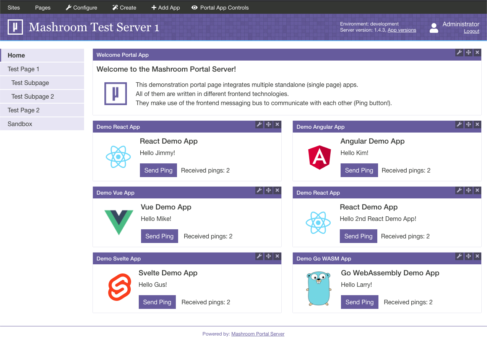

# Mashroom Server

## About ##

*Mashroom Server* is *Node.js* based **Integration Platform for Microfrontends**. It supports the integration of *Express* webapps on the
server side and composing pages from multiple *Single Page Applications* on the client side (Browser). It also provides common infrastructure such as
security, communication (publish/subscribe), theming, i18n, storage, and logging out of the box and supports custom middleware and services via plugins.

Mashroom Server allows it to implemented SPA's (and express webapps) completely independent and without any vendor lock-in and to use it on arbitrary pages
later with different configurations and even multiple times on the same page. It also allows it to restrict the access to apps based on user roles.

It is even possible to integrate SPA's deployed on a different server (e.g. a different docker container) which allows independent release cycles.

From a technical point of view the core of *Mashroom Server* is a plugin loader that scans npm packages (package.json) for
plugin definitions and loads them at runtime. Such a plugin could be an *Express* webapp or a *SPA* or more generally
all kind of code it knows how to load, which is determined by the available plugin loaders.
Plugin loaders itself are also just plugins so it is possible to extend the list of known plugin types.

Compared with the concepts in the Java world *Mashroom Server* would be an Application Server. And the *Mashroom Portal* plugin
has similar concepts than a Java Portal Server such as [Liferay](https://www.liferay.com/).

### Key features

 * Integration of existing _Express_ webapps
 * Shared middleware and services
 * Out of the box services for security, internationalization, messaging, storage and more
 * Pluggable providers for security, storage and and many other services
 * Role based permissions for URL's (ACL's)
 * Single configuration file to override plugin default configurations
 * Hot deploy, undeploy and reload of all kind of plugins
 * No compile or runtime dependencies to the server
 * Support for custom plugin types
 * Fast and lightweight
 * Portal plugin
    * Build pages from independent SPA's, even written in different technologies
    * Client-side message bus for inter-app communication which can be extended to server-side messaging
      to communicate with apps in other browsers or even 3rd party systems
    * Proxying of REST API calls to prevent CORS problems
    * Life registration of _Remote Apps_ (SPA's that run on a different server)
    * JS API to programmatically load portal apps into an arbitrary DOM node (even within another app)
    * Role based permissions for pages and apps
    * Support for global libraries that can be shared between the apps
    * Support for theming
    * Admin Toolbar to create pages and place apps via Drag'n'Drop
    * Hot reload of apps in development mode

## Quick Start

    git clone https://github.com/nonblocking/mashroom-portal-quickstart mashroom-portal-quickstart
    cd mashroom-portal-quickstart
    npm run setup
    npm start

Open http://localhost:5050 in your browser. Users: john/john, admin/admin

## Who is using Mashroom Server in production

 * [A1 Telekom Austria](https://www.a1.group/)

If you too are using *Mashroom Server* in production; please submit a PR to add your organization to the list!

## Homepage

https://www.mashroom-server.com

## Blog

https://medium.com/mashroom-server

## Full Documentation

https://www.mashroom-server.com/documentation

## Development

After cloning the repository just run

    npm run setup

to install all dependencies and build the core packages.

To start the test server:

    cd packages/test/test-server1
    npm start

The test server will be available at http://localhost:5050
